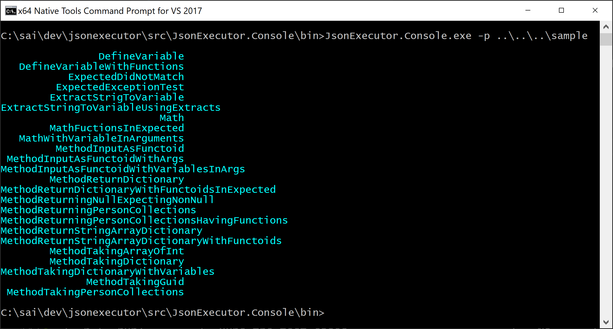

# jsonExector
Executes the api defined in Json format. Define API one time and use JSON to create multiple test cases with validation. Chain the outputs to feed in to the next API call through JSON data.

### Installing JsonExecutor

You should install [JsonExecutor with NuGet](https://www.nuget.org/packages/JsonExecutor):

    Install-Package JsonExecutor
    
Or via the .NET Core command line interface:

    dotnet add package JsonExecutor

Either commands, from Package Manager Console or .NET Core CLI, will download and install JsonExecutor and all required dependencies.

# Motivation
Write integration tests through configuration instead of code using JSON file format.

# Usage
* Identify the APIs test
* Define JSON with inputs and validations

# Sample
## Simple without using Variables
```json
[
  {
    "Name": "Math.Add",
    "Api": "add",
    "Parameters": {
      "num1": 10,
      "num2": 20
    },
    "Expected": {
      "result": 30
    }
  },
  {
    "Name": "Math.Sub",
    "Api": "sub",
    "Parameters": {
      "num1": 10,
      "num2": 20
    },
    "Expected": {
      "result": -10
    }
  }
]
```
## Using Variables
* Define variables
```json
{
  "mynum1": 33,
  "mynum2": 44,
  "item1": "val1",
  "item2": "val2"
}

```
* Use variables
```json
[
  {
    "Name": "Math.Add",
    "Api": "add",
    "Parameters": {
      "num1": "${var.mynum1}",
      "num2": 20
    },
    "Expected": {
      "result": 119
    }
  }
]
```
## Using Functions
```json
[
  {
    "Name": "Math.Add",
    "Api": "add",
    "Parameters": {
      "num1": "${random()}",
      "num2": 20
    }
  }
]
```

### Chaining outputs to inputs
```json
[
  {
    "Name": "ExtractVariable Test",
    "Api": "EchoString",
    "Parameters": {
      "input" :  "echo this one." 
    }
  },
  {
    "Name": "UsingVariable From previous test",
    "Api": "EchoString",
    "Parameters": {
      "input": "${extract(key=result)}"
    },
    "Expected": {
      "result": "echo this one."
    }
  }
]
```
## Using API
```csharp
* Define test json file
* Define __config.json__ with API
* Define __variables.json__ with variables
```csharp
  var tester = new JsonExecutor(ReadTestFile("Math.json"), ReadTestFile("config.json"), msg => { });
  tester.ExecuteAndVerify(new Dictionary<string, object>(){});
```

# JsonExecutor.Console
Console uses the JsonExecutor.Framework and one can execute set of test cases through this tool.

## Usage

Have the following files in a directory ( see the Sample)

### List the test cases


| Name                |  Description                                           | Directory/File  |
|---------------------|--------------------------------------------------------|-----------------|
| *app.config*        |  Standard .NET app.config used by the APIs             |   File          |
| *config.json*       |  Configuration file containing the assemblies names    |   File          |
| *variables.json*    |  Variables used by the test cases                      |   File          |
| *bin*               |  Assemblies containing the APIs                        |   Directory     |
| *tests*             |  Actual test files                                     |   tests         |

Run __JsonExecutor.Console.exe__

### Parameter
| Parameter         |  Description                                | Required  |
|-------------------|---------------------------------------------|-----------|
| -p (--path)       |  Base path of the test cases                |   Yes     |
| -f (--filter)     |  Test cases filter                          |   No      | 
| -l (--list)       |  List the test cases                        |   No      |
| -r (--run)        |  Runs the test cases                        |   No      |
| -v (--verbose)    |  Shows the debug messages                   |   No      |

## Running Sample
Naviage it to jsonexecutor\src\JsonExecutor.Console\bin
*JsonExecutor.Console.exe* -p ..\..\..\sample -f Math -r to run the test cases

### List the test cases


### Filter the test cases


### Run the test cases

